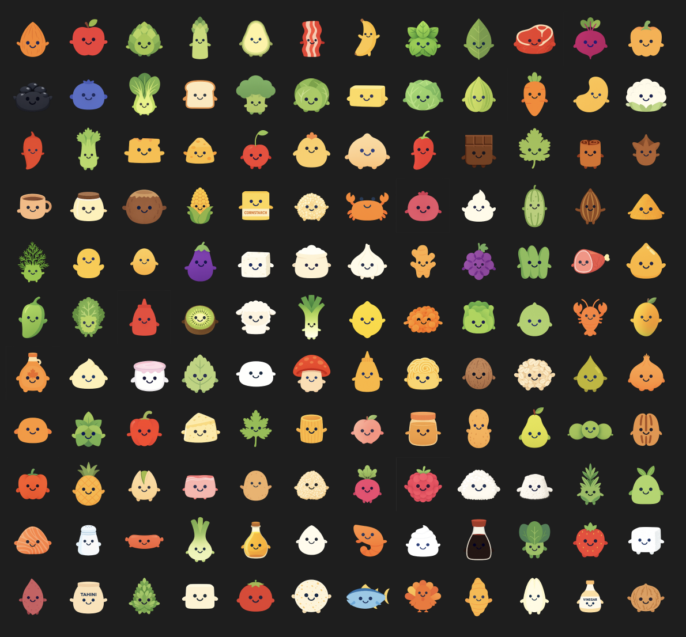

# food-icons

135 cute mascot-style food and ingredient icons with transparent backgrounds.



## style

- flat 2d vector design
- simple black curved line eyes and smile
- soft friendly colors
- transparent png backgrounds
- 1024x1024 resolution

## categories

**proteins** — chicken, beef, pork, salmon, shrimp, egg, tofu, bacon, turkey, lamb, tuna, duck, sausage, ham, crab, lobster

**vegetables** — onion, garlic, tomato, carrot, potato, broccoli, spinach, bell pepper, mushroom, celery, lettuce, cucumber, zucchini, corn, peas, green beans, cabbage, kale, asparagus, cauliflower, eggplant, sweet potato, leek, bok choy, brussels sprouts, jalapeno, artichoke, radish, beet, scallion

**fruits** — lemon, lime, apple, banana, orange, avocado, strawberry, mango, pineapple, peach, grape, blueberry, raspberry, watermelon, coconut, cherry, pear, kiwi, cranberry

**dairy** — butter, milk, cheese, cream, yogurt, parmesan, mozzarella, cheddar, feta, ricotta, sour cream

**grains** — rice, pasta, flour, bread, noodles, oats, quinoa, couscous, tortilla

**seasonings** — salt, pepper, paprika, cumin, oregano, basil, thyme, rosemary, cinnamon, ginger, chili, turmeric, nutmeg, clove, cardamom, bay leaf, dill, parsley, cilantro, mint, sage, cayenne, curry powder

**oils & sauces** — olive oil, soy sauce, honey, vinegar, sugar, ketchup, mustard, mayonnaise, sesame oil, coconut oil, maple syrup, peanut butter, tahini

**nuts & seeds** — almond, walnut, peanut, cashew, pistachio, pecan, sesame seeds

**legumes** — black beans, chickpeas, lentils

**other** — chocolate, cocoa, vanilla, cornstarch

## usage

```html

```

## license

mit — free for personal and commercial use

